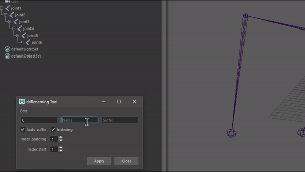
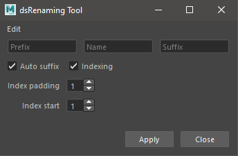
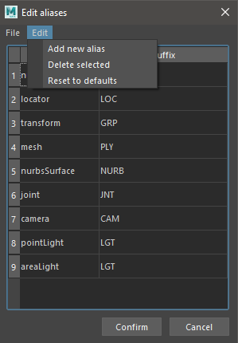

# dsRenamingTool


## Key features:
- Optional prefix, suffix fields
- Auto indexing
- Auto suffixing
- Customizable object type suffix aliases
- import/export aliases

## Instalation
A) **Module approach** <br>
1) Place repo folder anywhere on your PC <br>
2) In your documents/maya/modules directory create "dsRenamingTool.mod" file with the following code:
```
+ dsRenamingTool 1.0 YourPathHere/dsRenamingTool
scripts: YourPathHere/dsRenamingTool
```

B) **Normal scripts approach**<br>
1) Copy dsRenamingTool folder with py in it (not main repo) to your documents/maya/scripts directory

## Usage
A) Run mainDialog.py<br>
B) Import dsRenamingTool, dsRenamingTool.Dialog.display()

## Dialogs
**Main dialog**:




**Alias editor**:


